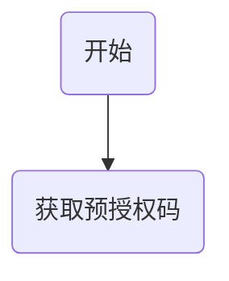

# 微信开放平台
## 三方平台接口对接

### 授权流程


授权网页链接:
https://mp.weixin.qq.com/cgi-bin/componentloginpage?component_appid=xxxx&pre_auth_code=xxxxx&redirect_uri=xxxx&auth_type=xxx。

### 创建小程序

https://developers.weixin.qq.com/doc/oplatform/Third-party_Platforms/Mini_Programs/Fast_Registration_Interface_document.html

### 授权类型

要授权的帐号类型， 
1 则商户扫码后，手机端仅展示公众号、
2 表示仅展示小程序，
3 表示公众号和小程序都展示。
如果为未指定，则默认小程序和公众号都展示。

### 参考文档

[第三方开放平台接口开发文档](https://developers.weixin.qq.com/doc/oplatform/Third-party_Platforms/Authorization_Process_Technical_Description.html)

### 3、公众号，小程序授权调整

#### 1) 使用appid,secret,ticket 交换第三方token 
```接口：/cgi-bin/component/api_component_token
json参数：{
  "component_appid":  "appid_value" ,
  "component_appsecret":  "appsecret_value",
  "component_verify_ticket": "ticket_value"
}
```
#### 2) 生成预授权码
```
接口：/cgi-bin/component/api_create_preauthcode?component_access_token=COMPONENT_ACCESS_TOKEN
参数：{
  "component_appid": "appid_value" 
}
```
#### 3）根据生成预授权码生成url
```
接口：/componentloginpage?component_appid={0}&pre_auth_code={1}&auth_type={3}&redirect_uri={2}
component_appid	是	第三方平台方 appid
pre_auth_code	是	预授权码
redirect_uri	是	回调 URI
auth_type	否	要授权的帐号类型， 
1 则商户扫码后，手机端仅展示公众号、
2 表示仅展示小程序，
3 表示公众号和小程序都展示。如果为未指定，则默认小程序和公众号都展示。第三方平台开发者可以使用本字段来控制授权的帐号类型。
biz_appid	否	指定授权唯一的小程序或公众号

```
#### 4、保存授权信息（可以暂时使用业务系统中的）
```
```
#### 5、获取公众号或小程序access_token
```
接口：/cgi-bin/component/api_authorizer_token?component_access_token=COMPONENT_ACCESS_TOKEN
参数：{
  "component_appid": "appid_value",
  "authorizer_appid": "auth_appid_value",
  "authorizer_refresh_token": "refresh_token_value"
}
```
#### 5、小程序发布中模板信息
```
获取小程序版本
接口：/wxa/gettemplatelist?access_token=
```
#### 6、授权事件接收

## H5


## PC端

### 1、第三方平台配置

### 2、微信推送的ticket收录

1）从url 中获取nonce（随机数），timestamp（时间缀），msg_signature（微信那边的签名）
2）读取post的数据，解析xml，获取xml中的加密信息、
3）生成签名，根据token（检验token)、timestamp（时间缀）,nonce（随机数）,encryptmsg(加密密文)
4）校验签名是否正确
5) 减密密文，获取appid，根据aeskey
6）校验appid与第三方的是否一致
7）返回减密后的内容，并保存ticket

