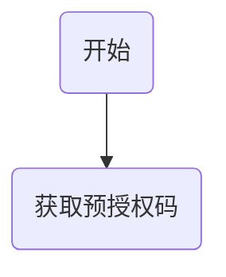

# 三方平台接口对接

### 授权流程

授权网页链接:
https://mp.weixin.qq.com/cgi-bin/componentloginpage?component_appid=xxxx&pre_auth_code=xxxxx&redirect_uri=xxxx&auth_type=xxx。

### 创建小程序

https://developers.weixin.qq.com/doc/oplatform/Third-party_Platforms/Mini_Programs/Fast_Registration_Interface_document.html

### 授权类型

要授权的帐号类型， 
1 则商户扫码后，手机端仅展示公众号、
2 表示仅展示小程序，
3 表示公众号和小程序都展示。
如果为未指定，则默认小程序和公众号都展示。

### 参考文档

[第三方开放平台接口开发文档](https://developers.weixin.qq.com/doc/oplatform/Third-party_Platforms/Authorization_Process_Technical_Description.html)